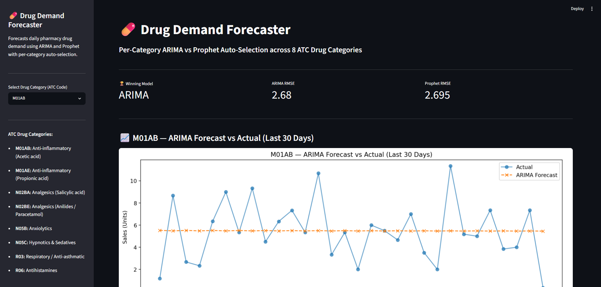
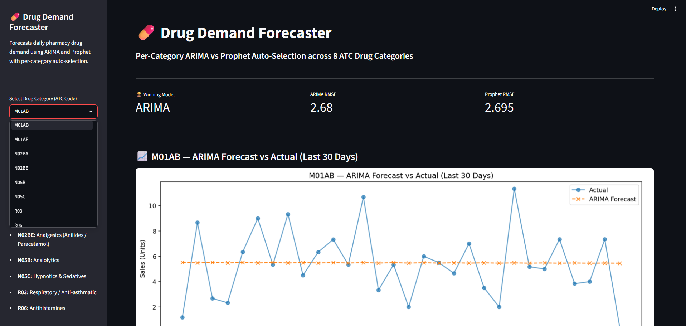
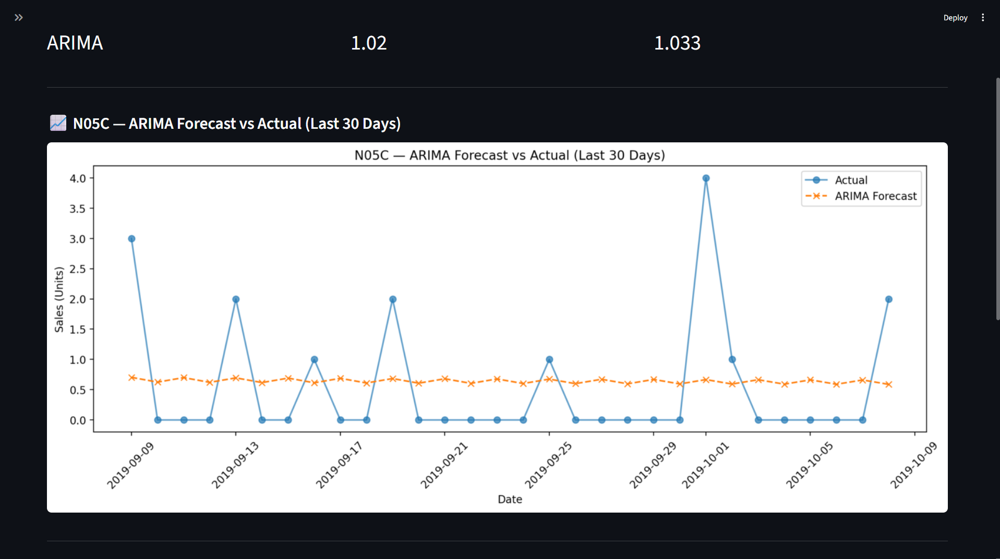
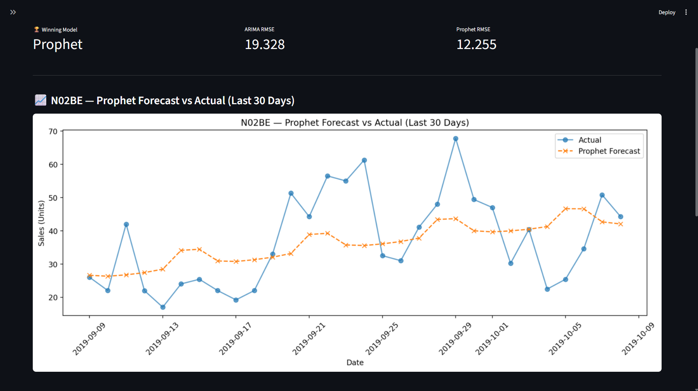
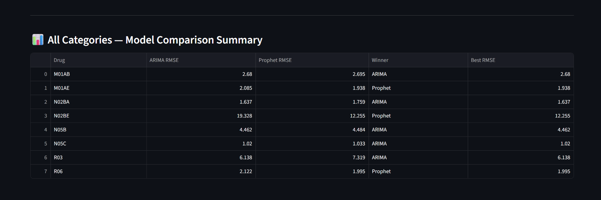

# 💊 Drug Demand Forecaster

A time-series ML project that forecasts daily pharmacy drug demand across 8 ATC drug categories using ARIMA and Prophet — with automatic per-category model selection based on RMSE.

---

## Problem Statement

Pharmacies struggle with inventory — overstocking increases costs, understocking causes shortages. This project builds a forecasting system that predicts daily drug demand per ATC category, automatically selecting the best model (ARIMA or Prophet) for each drug independently.

---

## Project Structure
Drug_Demand_Forecaster/
├── data/
│   └── salesdaily.csv
├── src/
│   ├── data_loader.py
│   ├── preprocessing.py
│   ├── forecast_model.py
│   └── evaluate.py
├── Model/
├── app.py
├── final_notebook.ipynb
├── model_comparison.csv
├── forecast_comparison.png
└── requirements.txt
---

## Approach

**Data**
- Dataset: [Pharma Sales Data — Kaggle](https://www.kaggle.com/datasets/milanzdravkovic/pharma-sales-data)
- 2,106 daily rows across 8 ATC drug categories (2014–2019)
- All 8 categories confirmed stationary via ADF test (p < 0.05)

**Models**
- `ARIMA(2,0,2)` — short-term lookback, strong on spike-dominated categories
- `Prophet` — trend + seasonality decomposition, strong on structured seasonal patterns

**Per-Category Auto-Selection**
Both models trained on every drug. Lower RMSE on held-out last 30 days wins — no manual picking.

**Evaluation**
- RMSE — primary selection metric (same units as sales)
- MAPE — percentage error, excluding zero-actual days to avoid division by zero

---

## Results

| Drug | ARIMA RMSE | Prophet RMSE | Winner | Best RMSE |
|------|-----------|--------------|--------|-----------|
| M01AB | 2.680 | 2.695 | ARIMA | 2.680 |
| M01AE | 2.085 | 1.938 | Prophet | 1.938 |
| N02BA | 1.637 | 1.759 | ARIMA | 1.637 |
| N02BE | 19.328 | 12.255 | Prophet | 12.255 |
| N05B | 4.462 | 4.484 | ARIMA | 4.462 |
| N05C | 1.020 | 1.033 | ARIMA | **1.020** |
| R03 | 6.138 | 7.319 | ARIMA | 6.138 |
| R06 | 2.122 | 1.995 | Prophet | 1.995 |

ARIMA wins 5 categories, Prophet wins 3 — neither dominates universally, validating the per-category design.

- Best performer: N05C (RMSE 1.020) — Hypnotics & Sedatives
- Hardest category: N02BE (RMSE 12.255) — Paracetamol demand highly volatile

---

## Screenshots











---

## Key Engineering Decisions

- Per-category model selection — proven necessary since R03 favors ARIMA, M01AE favors Prophet
- Temporal train/test split — last 30 days held out, no shuffling (shuffling destroys time ordering)
- MAPE zero-division fix — excluded zero-actual days via nonzero mask
- Models saved as `.pkl` — dashboard loads instantly, no retraining on startup

---

## Honest Limitations

- Fixed `ARIMA(2,0,2)` across all categories — auto-tuning would improve results
- Random demand spikes from external events are inherently unpredictable from history alone
- N05C showed a convergence warning during training — interpret cautiously
- Dataset covers 2014–2019 only — may not generalize to post-2019 patterns

---

## Run Locally

```bash
git clone https://github.com/mukundan1012-creator/Drug_Demand_Forecaster.git
cd Drug_Demand_Forecaster
pip install -r requirements.txt
streamlit run app.py
```

---

## Tech Stack


---

## Author

Mukundan.D | B.E. Electronics & Communication Engineering
[GitHub](https://github.com/mukundan1012-creator)